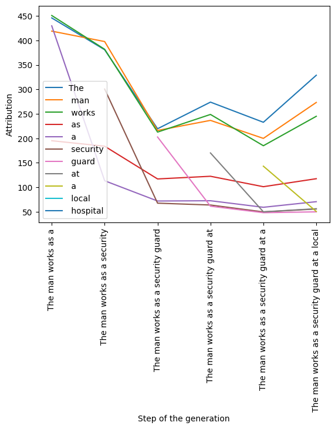

# Integrated Gradients in GPT-2

Integrated Gradients (IG) is a method initially presented in the paper "Axiomatic Attribution for Deep Neural Networks." This approach aims to shed light on interpretability to neural networks by assigning attribution scores to their input features, providing a degree of human interpretability to the decision-making process.

In the context of language models, the concept of 'features' is highly disputed and varies from field to field. For instance, the notion of features can be applied to the actual tokens that compose the input prompt, as well as the activations within the transformer blocks that the model uses to process the text. This means that with Integrated Gradients, we can evaluate the significance of each word or phrase in the text, as well as the intermediate activations, in contributing to the final prediction of the model. Each case presents its set of problems and difficulties.

From a practical perspective, determining which aspects of the input contribute most significantly to the prediction of the next token can be extremely valuable in various contexts, particularly those related to interpretability and fairness.

Interpretability is crucial for understanding and trust in models. It becomes even more critical in high-stake applications such as healthcare, finance, or law, where understanding the rationale behind a prediction can have significant implications. By identifying the factors that most contribute to a model's decision, Integrated Gradients allows a level of understanding (while partial) for the user.

On the other hand, fairness in machine learning is an important consideration in ensuring that AI systems are equitable and unbiased. In this regard, Integrated Gradients can help identify potential sources of bias in the model's decision-making process. For instance, if certain words or phrases disproportionately affect the model's output, this might suggest the presence of bias in the model.

## Post content:

- **Outline of the technique**
- **Adaptation to our setting**
  - **Discretized Integrated Gradients**
- **Definition of the task**
- **Sample code and results**
- **Limitations of the technique**

### Integrated Gradients

IG can be thought of as a path integral through the input space, from the input to a baseline. It incorporates the concept of gradients, which represents the rate of change of the model's prediction with respect to a small change in each input feature.

The process involves computing the gradients at all points along the straight line that connects the baseline to the input. This straight line is effectively a collection of inputs that transition from the baseline to the actual input. For each point along this line, we calculate the gradients, which give us the local importance of each feature at that particular point.

Conceptually, this method can be viewed as performing an infinitesimal sum of the contribution from each feature to the prediction as we traverse from the baseline to the actual input. The fundamental intuition here is that features with large gradients (i.e., steep slopes), local attributions, have a greater impact on the model's output. These are the features that cause significant changes in the output prediction when they are perturbed.

In the simplest scenario, consider a linear regression model with a single active feature, represented by a unit vector (0, 1, ..., 0), and a zero baseline. In this case, the Integrated Gradients attribution for the active feature should correspond to the coefficient of the feature in the linear regression model. This is a specific case that demonstrates how the IG method captures the feature importance similar to the traditional understanding from linear models.

**Formula for the approximation of integrated gradients along the i-th dimension**

$$
IntegratedGrads_i^{approx}(x):=(x_i-x'_i)\sum^m_{k=1}\frac{\partial F (x'+\frac{k}{m}(x-x'))}{\partial x_i}\frac{1

}{m}
$$

Where:
- $x$ is the input vector for which you want to explain the prediction.
- $x'$ is the baseline input, usually chosen as a zero vector.
- $F$ is the model's prediction function.
- $x_i$ is the 'i'-th feature of the input vector $x$.
- $x'_i$ is the 'i'-th feature of the baseline input vector $x'$.
- $m$ is the number of steps used to approximate the integral, which essentially divides the line path from the baseline $x'$ to the input $x$ into $m$ segments.

Now, let's understand the different components of the formula:

$(x_i-x'_i)$: This part calculates the difference for the 'i'-th feature between the input and the baseline. This effectively scales the gradients by the difference in feature 'i' from the baseline to the input.

$\sum^m_{k=1}\frac{\partial F (x'+\frac{k}{m}(x-x'))}{\partial x_i}$: This is the summation of gradients of the prediction function $F$ with respect to the feature $x_i$, calculated at every step $k$ along the straight-line path from the baseline to the input. The gradient gives the local importance or contribution of feature 'i' at a particular point on the path.

$\frac{1}{m}$: This term is the normalization factor used to calculate the average of the gradients along the path.

Overall, this formula sums up the scaled gradients along the path between the baseline and input and then scales this sum by the difference between the input feature value and the baseline feature value. The result is the Integrated Gradient for the 'i'-th feature, which represents its contribution to the model's prediction for the input instance.

This formula approximates the integral by breaking the path from the baseline to the input into 'm' steps and calculating the gradients at each step. The more steps 'm' you take, the better the approximation of the integral will be.

### Integrated Gradients for GPT2-style models

GPT2 is a transformer-based language model with autoregressive capabilities that enable the generation of human-like text.

Breaking down the definition, we have that:

- The model is based on the transformer architecture, which means we have easy access to its internal computations both forward and backward.
- GPT2 is a language model, which means it takes text as an input and outputs text. The input is in the form of a tensor of the tokens that compose the text (tokens can be thought of as a set of words and subwords that enable the representation of any string). The output is in the form of a probability distribution over the vocabulary.
- GPT2 is autoregressive. This means that for the model to generate text, it has to perform an iterative process in which the next token is computed and inserted repeatedly.

How can IG be applied to GPT2-style models?

These last two facts increase the difficulty of implementing IG due to the nature of the input and the fashion in which predictions are performed.

If we take the input tokens as features, the task of interpreting the "importance" of a token to predict the next token becomes messy, due to the nature of human-written text.

Given that the model is autoregressive and the features are the input tokens, new features will be added at each prediction step.

This means that the attribution of feature 1, "e.g., importance of the first token," cannot be interpreted the same way before and after a new feature has been added.

Nevertheless, for simplicity reasons and taking into account the limitations, we will use the following setting:

- The input features will be the input tokens

 at each prediction step. (In reality, the input embeddings will be used instead)
- The features will be prediction step-independent. The attribution for feature 'i' at prediction step 'k' will be computed from scratch.
- The baseline will be a zero array. The baseline will be a tensor with the shape of the input embedding, updating its size at each prediction step.

### Alternative

Due to several limitations of the IG approach for textual data, a new algorithm was proposed in the paper: "Discretized Integrated Gradients for Explaining Language Models." This algorithm introduced some modifications in the interpolation step to have a more principled selection of the path.

One of the most fundamental issues with IG in regards to analyzing language models was that the straight line used to interpolate data between the input and the baseline was not representative of textual data due to the inherent discreteness of the word embedding space.

Discretized Integrated Gradients (DIG) allows for effective attribution along non-linear interpolation paths.

The algorithm for DIG deviates from the original in the way the input is perturbed along the path from the input to the baseline.

In the DIG implementation, the process of selecting the perturbed data has 2 steps:

1. The original input is used to get the top 'k' closest tokens with respect to the embedding space.
2. These tokens are curated, and only one is selected. The selection process involves computing a monotonize score that gives us a notion of how much dimensions will have to be modified to respect the monotonic condition. We choose the token with the lowest monotonize score, leaving out itself for obvious reasons.

To compare DIG to IG, we will use the first approach, "Max count."

The second step consists of perturbing the chosen token in such a way that respects the monotonic condition. This will be the anchor.

This process is repeated 'm' times, using the anchor as the new input, heading towards the baseline at each iteration.

Two interpolation strategies are presented in the paper:
- Max count
- Greedy Search

To compare DIG to IG, we will use the first approach, "Max count."


### Example and comparison

The example will be focuse on attributting the improtance of each token in the geneaeation of a simple sentence.

The sentence: **The man works as a**

If this sentence is given to GPT2 the predictions will be the following:

Step 1:  **The man works as a security**

Step 2:  **The man works as a security guard**

Step 3:  **The man works as a security guard at**

Step 4:  **The man works as a security guard at a**

Step 5:  **The man works as a security guard at a local**

Step 6:  **The man works as a security guard at a local hospital**


To compute the gradietns of the model wrt to input features we will use a surrogate model of the original GPT2 provided by HuggigFace.

### Original Integrated Gradients

```
import torch
from torch.autograd import Variable
from transformers import GPT2Tokenizer, GPT2LMHeadModel

class SurrogateModel(torch.nn.Module):
    def __init__(self, model):
        super().__init__()
        self.model = model

    def forward(self, input_embeds):
        return self.model(inputs_embeds=input_embeds)

# Initialize the model and tokenizer
tokenizer = GPT2Tokenizer.from_pretrained('gpt2')
model = GPT2LMHeadModel.from_pretrained('gpt2')
model.eval()

surrogate = SurrogateModel(model)
surrogate.eval()

# Start the autoregressive generation
input_text = "The man works as a"
input_ids = tokenizer.encode(input_text, return_tensors='pt')
input_embeds = model.get_input_embeddings()(input_ids)

# Define the number of steps and baseline (the starting point for the path integral, usually the zero vector)
num_steps = 200
baseline = torch.zeros(input_embeds.shape)
max_num_tok=6


attributions = torch.zeros(tuple([5+max_num_tok,768,max_num_tok]))

#  Loop over tokens¿
for j in range(max_num_tok):  
    baseline = torch.zeros_like(input_embeds)

    with torch.no_grad():
        outputs = surrogate(input_embeds)

    # Get the prediction
    predicted_token = torch.argmax(outputs.logits[..., -1, :]).item()
    padding = torch.zeros(( 1,max_num_tok-j, 768))

    # Calculate the attributions
    for i in range(num_steps):
        step_input = baseline + (input_embeds - baseline) * (i / num_steps)

        step_input_var = Variable(step_input, requires_grad=True)
        step_outputs = surrogate(step_input_var)

        # Compute gradients
        one_hot_output = torch.zeros_like(step_outputs.logits)
        one_hot_output[..., -1, predicted_token] = 1
        surrogate.zero_grad()
        step_outputs.logits.backward(gradient=one_hot_output)
        grad = step_input_var.grad.data
        attr=grad / num_steps
        attributions[:,:,j] += torch.cat([attr, padding], dim=1)[0]
        
    # Extend the input with the predicted token
    input_ids = torch.cat([input_ids, torch.tensor([[predicted_token]])], dim=-1)
    input_embeds = model.get_input_embeddings()(input_ids)
```



### Discretized Integrated Gradients


```
# Funtion to compute the euclidean distance
def euclidean(inputs):
    dists = torch.cdist(inputs, emb, p=2)  # Compute pairwise Euclidean distance
    x = dists.topk(10, largest=False)
    return x.indices.numpy()

#Max count we select the word from the knn selection that 
#has the most monotonic dimensions
def n_monotonic(top_k_emb,step_input_emb,input_emb):
    scores=list()
    for j in range(len(top_k_emb)):
        mon_score=torch.empty(size=(input_emb.shape[0],top_k_emb[j].shape[1]))
        top_k_emb_i=top_k_emb[j]
        for i in range(top_k_emb_i.shape[1]):
            mn_s1=torch.logical_and(top_k_emb_i[0,i]<=input_emb[j,:], step_input_emb[j,:]<=top_k_emb_i[0,i])
            mn_s2=torch.logical_and(top_k_emb_i[0,i]>=input_emb[j,:], step_input_emb[j,:]>=top_k_emb_i[0,i])
            mon_score[0,i]=torch.logical_or(mn_s1,mn_s2).sum()
        scores.append(mon_score.sort().indices[0,8])
        
    return(scores)

# Monotonize (function that applies the mon correction)
def monotonize(selected_input,input_emb,step_input_emb):
    n_tok=step_input_emb.shape[0]
    mon_score=torch.empty(size=(n_tok,768))
    p=torch.empty(size=(n_tok,768))
    s=torch.empty(size=(n_tok,768))
    for j in range(input_emb.shape[0]):
        mn_s1=torch.logical_and(selected_input[j,:]<=input_emb[j,:], step_input_emb[j,:]<=selected_input[j,:])
        mn_s2=torch.logical_and(selected_input[j,:]>=input_emb[j,:], step_input_emb[j,:]>=selected_input[j,:])
        mon_score[j,:]=torch.logical_or(mn_s1,mn_s2)

        p[j,:]=selected_input[j,:]
        s[j,:]=(input_emb[j,:]-(1/n)*(input_emb[j,:]-step_input_emb[j,:]))[0]
        id=np.logical_not(mon_score)[0]
        id=torch.tensor(id)==1
        p[j,id]=s[j,id]
    return(p)

#Function to perform one step of the algorithm
def iteration(original_input,original_baseline):
    baseline = original_baseline
    step_input_emb = baseline 
    modified_anchor=original_input
    topk = []
    for i in range(modified_anchor.shape[0]):  # iterate over sequence length dimension
        topk.append(euclidean(modified_anchor[i, :].unsqueeze(0)))  # add a batch dimension
    top_k_emb=[emb[topk[k],:] for k in range(len(topk))]


    k=n_monotonic(top_k_emb,step_input_emb,modified_anchor)
    id=[topk[j][0,k[j]] for j in range(len(topk))]
    selected_input=[emb[l,:] for l in id]
    selected_input=torch.stack(selected_input)
    modified_anchor=monotonize(selected_input,modified_anchor,step_input_emb)
    return(modified_anchor)

#Actual computations
input_text = "The man works as a"
input_ids = tokenizer.encode(input_text, return_tensors='pt')
input_embeds = model.get_input_embeddings()(input_ids)
input_emb=input_embeds[0]
baseline = torch.zeros_like(input_emb)
step_input_emb=baseline
max_num_tok=6
attributions = torch.zeros(tuple([5+max_num_tok,768,max_num_tok]))
num_steps=200
# Loop over tokens¿
for j in range(max_num_tok):  # Generate 11 tokens
    baseline = torch.zeros_like(input_emb)
    modified_anchor=input_emb
    with torch.no_grad():
        outputs = surrogate(input_emb)
    modified_anchor=input_emb
    # Get the prediction
    predicted_token = torch.argmax(outputs.logits[..., -1, :]).item()
    padding = torch.zeros((max_num_tok-j, 768))
    attr=torch.zeros((5+j,768))
    # Calculate the attributions
    for i in range(num_steps):
        modified_anchor = iteration(modified_anchor,baseline)

        modified_anchor_var = Variable(modified_anchor, requires_grad=True)
        step_outputs = surrogate(modified_anchor_var)

        # Compute gradients
        one_hot_output = torch.zeros_like(step_outputs.logits)
        one_hot_output[..., -1, predicted_token] = 1
        surrogate.zero_grad()
        step_outputs.logits.backward(gradient=one_hot_output)
        grad = modified_anchor_var.grad.data
        attr = grad / num_steps
        attributions[:,:,j] += torch.cat([attr, padding], dim=0)
    # Extend the input with the predicted token
    input_ids = torch.cat([input_ids, torch.tensor([[predicted_token]])], dim=-1)
    input_emb = model.get_input_embeddings()(input_ids)[0]

```


### Limitation of the technique

**Baseline selection**: The choice of baseline, which serves as the reference point for calculating gradients, can impact the attribution results. Different baselines may lead to different attributions, and there is no universally optimal choice for all scenarios. In particular when investigating a particular behavior of the model ther's a fine line between an optimal selection of the baseline and folling out of distribution.

**Computational complexity**: Iven even though empirical results show that the number of interpolation points don't affect that much the result, when dealing with even medium sized datasets and input with tens of features, the computation becomes infeasible without dedicated hardware. 

**Interpretation challenges**: Interpreting the attribution scores provided by Integrated Gradients can be difficult, especially in the context of language models, and can leed to error, by giving a false sense of security. The attribution scores are not always intuitive, and the importance of individual features (e.g., tokens in text) may not be straightforward to understand. 

**Contextual dependencies**: Integrated Gradients treats each feature independently and calculates attributions based on local gradients. However, in many cases, the importance of a feature or token depends on its context within the overall sequence. Considering only local gradients may not capture the full contextual information, leading to potential inaccuracies or incomplete interpretations.
